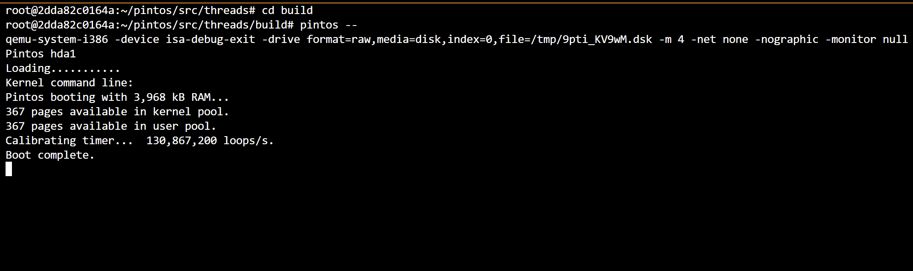
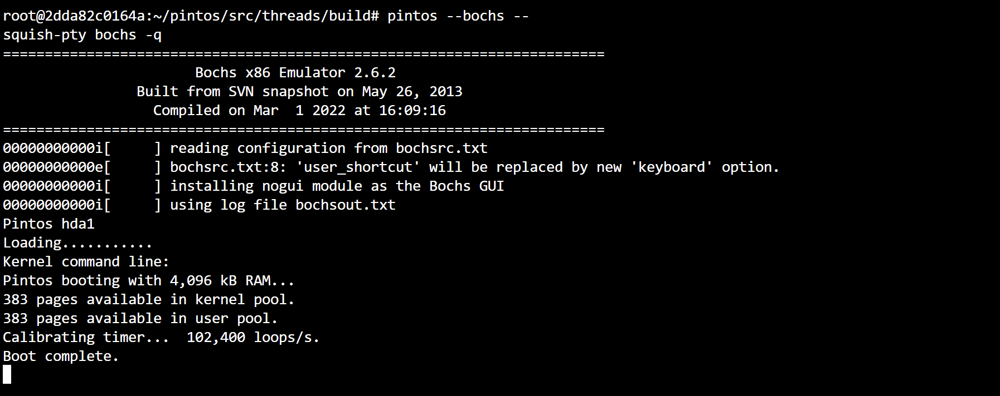
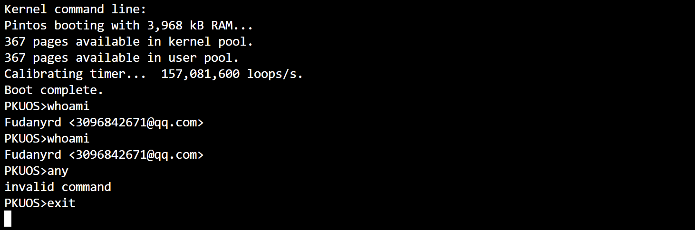

# Project 0: Getting Real

## Preliminaries

>Fill in your name and email address.

Rundong Yang <3096842671@qq.com>

>If you have any preliminary comments on your submission, notes for the TAs, please give them here.

**None**

>Please cite any offline or online sources you consulted while preparing your submission, other than the Pintos documentation, course text, lecture notes, and course staff.

**None**

## Booting Pintos

>A1: Put the screenshot of Pintos running example here.
  

## Debugging

#### QUESTIONS: BIOS 

>B1: What is the first instruction that gets executed?
ljmp   $0x3630,$0xf000e05b

>B2: At which physical address is this instruction located?
0x0000fff0

#### QUESTIONS: BOOTLOADER

>B3: How does the bootloader read disk sectors? In particular, what BIOS interrupt is used?

The boot loader use the `read_sector` subroutine to read disk sectors. The bios interrupt id is
`0x13`.

>B4: How does the bootloader decides whether it successfully finds the Pintos kernel?

The bootloader compares the magic number to decide if a sector contains pintos kernel partition.
Since we limit the kernel to be 512KB, so it is easy enough to read the entire contents of partition.

>B5: What happens when the bootloader could not find the Pintos kernel?

It will print the error message "\rNot found\r" and use interrupt `0x18` to notify the BIOS.

>B6: At what point and how exactly does the bootloader transfer control to the Pintos kernel?

At instruction `ljmp   $0x3630,$0xf000e05b`.

#### QUESTIONS: KERNEL

>B7: At the entry of pintos_init(), what is the value of expression `init_page_dir[pd_no(ptov(0))]` in hexadecimal format?

0

>B8: When `palloc_get_page()` is called for the first time,

>> B8.1 what does the call stack look like?
>> (gdb) bt
>> #0  palloc_get_page (flags=(PAL_ASSERT | PAL_ZERO)) at ../../threads/palloc.c:112
>> #1  0xc00203aa in paging_init () at ../../threads/init.c:168
>> #2  0xc002031b in pintos_init () at ../../threads/init.c:100
>> #3  0xc002013d in start () at ../../threads/start.S:180
>> 

>> B8.2 what is the return value in hexadecimal format?
>> Value returned is $7 = (void *) 0xc0101000
>> 

>> B8.3 what is the value of expression `init_page_dir[pd_no(ptov(0))]` in hexadecimal format?
>> 0
>> 

>B9: When palloc_get_page() is called for the third time,

>> B9.1 what does the call stack look like?
>> (gdb) bt
>> #0  palloc_get_page (flags=PAL_ZERO) at ../../threads/palloc.c:112
>> #1  0xc0020a81 in thread_create () at ../../threads/thread.c:178
>> #2  0xc0020976 in thread_start () at ../../threads/thread.c:111
>> #3  0xc0020334 in pintos_init () at ../../threads/init.c:119
>> #4  0xc002013d in start () at ../../threads/start.S:180
>> 

>> B9.2 what is the return value in hexadecimal format?
>> 0xc0103000
>> 

>> B9.3 what is the value of expression `init_page_dir[pd_no(ptov(0))]` in hexadecimal format?
>> 0x102027 
>> 

## Kernel Monitor

>C1: Put the screenshot of your kernel monitor running example here. (It should show how your kernel shell respond to `whoami`, `exit`, and `other input`.)

#### 

>C2: Explain how you read and write to the console for the kernel monitor.
Use `input_getc` to get the console and put it in the buffer; when receiving "enter" parse and execute the command.
Since this is a trivial shell implementation, this does not support special characters like '\b'.
